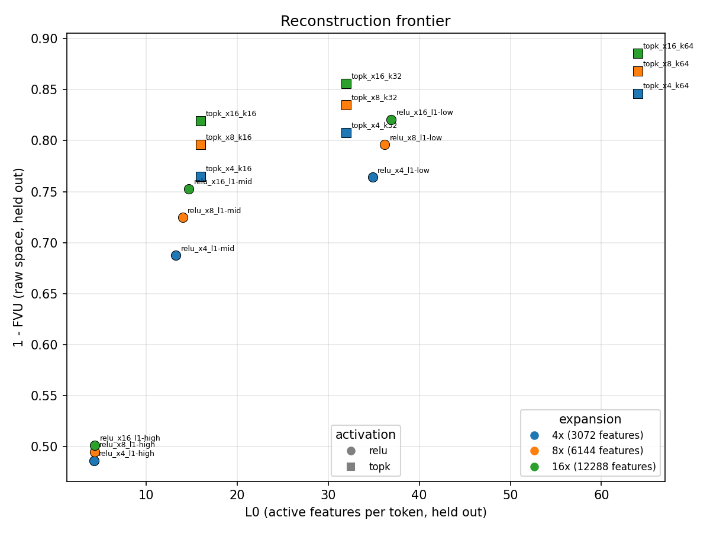
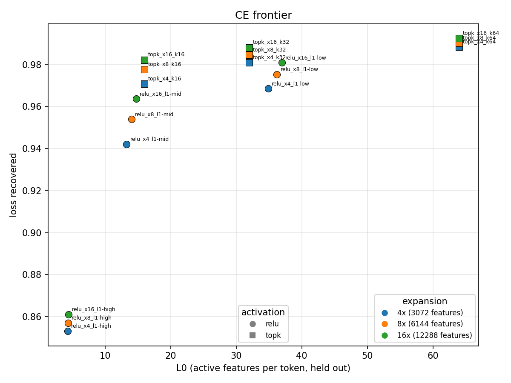

# sae-gpt2

Sparse autoencoders on the GPT-2-small residual stream at layer 8
(`blocks.8.hook_resid_post`, d_model 768), in two variants selectable per
run: ReLU + L1 and TopK (Gao et al. 2024) with optional AuxK. Training
reads pre-tokenized shards of `monology/pile-uncopyrighted` (220M-token
train shard, document-disjoint 20K-document held-out shard) through a
GPU-resident shuffle buffer; the recipe is 200M tokens per run at batch
4096, and every published number comes from a 2M-token held-out
evaluation (`eval.py`) reproducible from the run's checkpoint. Everything
below was measured on one NVIDIA A10 (24 GB), torch 2.7.0, headless over
SSH; the code also runs on CPU (tests, `smoke_test.py`). Best model in
the tree: TopK k=64 at 16x (12288 features), 1-FVU 0.885 and loss
recovered 0.992 on held-out data; best under L0 <= 40: TopK k=32 at 16x,
0.856 / 0.988 (see results).

## results

The 18-run frontier (`sweeps/frontier.json`, `results/frontier/`): ReLU +
L1 at lambda in {2.5e-3, 5e-3, 1e-2} and TopK (+ AuxK at the paper
defaults, aux_k = 2k, aux_coeff = 1/32) at k in {16, 32, 64}, each at
expansion 4x / 8x / 16x (3072 / 6144 / 12288 features). Every run: 200M
tokens (200,003,584) at batch 4096 (48,828 steps), lr 4e-4 after a
1000-step warmup, AdamW betas (0.9, 0.99), seed 42, resampling every
5000 steps, 1M-row buffer, `--forward hf`; evaluated on the same
2,007,616 held-out tokens (fp32, position 0 excluded; CE clean 3.859,
zero 13.813 on every row). 18 of 18 ok, 792.6 min total wall
(`results/frontier/index.jsonl`).





Best per width at L0 <= 40 (`figures/tables.md`; the full 18-row table
with CE, dead fractions, tok/s and wall time is in that file):

| expansion | features | best 1-FVU run | 1-FVU | L0 | best loss_recovered run | loss_recovered | L0 |
|---|---|---|---|---|---|---|---|
| 4x | 3072 | topk_x4_k32 | 0.808 | 32.0 | topk_x4_k32 | 0.981 | 32.0 |
| 8x | 6144 | topk_x8_k32 | 0.835 | 32.0 | topk_x8_k32 | 0.985 | 32.0 |
| 16x | 12288 | topk_x16_k32 | 0.856 | 32.0 | topk_x16_k32 | 0.988 | 32.0 |

Reading the frontier: TopK dominates ReLU + L1 at every width and
sparsity - 0.04-0.08 of 1-FVU ahead at matched L0, and at half the L0 it
matches L1 (`topk_x4_k16` 0.765 at L0 16 vs `relu_x4_l1-low` 0.764 at L0
34.9). Width helps monotonically and by about the same step everywhere,
~0.02-0.03 of 1-FVU per doubling at every k (k=32: 0.808 -> 0.835 ->
0.856; k=64: 0.846 -> 0.868 -> 0.885), with no sign of saturation at
16x. The lambda = 1e-2 column is the L1 collapse regime - L0 4.3-4.4
with 37-44% of features dead at eval and 1-FVU 0.49-0.50 - so the L1
curve effectively covers L0 4-37. Seed-to-seed noise on this recipe is
under 0.001 of 1-FVU (`results/seeds/`: `topk_x4_k32` at seeds 42/1/2
spans 0.0005, `relu_x4_l1-low` 0.0007), 30-100x smaller than every gap
above; the one near-tie, `relu_x16_l1-low` 0.821 vs `topk_x16_k16`
0.819, is ~3x the noise and should be read as "about equal". Without the
L0 cap the k=64 rows win trivially; the best point without the cap is
`topk_x16_k64`: 1-FVU 0.885, loss recovered 0.992 (CE 3.859 -> 3.934
nats vs 13.813 zero-ablated) at L0 64.

The default recipe (`python main.py` with no flags: ReLU 8x, lambda
5e-3, 200M tokens) was run twice as a check - `results/a6_default`
(derived schedule, warmup 976 / resample 6103) and `results/mvp` (the
frontier's pinned 1000 / 5000, `sweeps/mvp.json`): 1-FVU 0.7249 vs
0.7254, loss recovered 0.9533 vs 0.9539, L0 14.0 vs 14.1 - the two
schedules agree to 0.0005 of 1-FVU and both reproduce the frontier's
`relu_x8_l1-mid` cell (0.725 / 0.954 / L0 14.0). `results/SUMMARY.md`
tabulates all of this, names the source file for every number, and
records the anomalies (resample churn, transient AuxK engagement)
measured from the per-run train logs.

**Reproducibility contract.** Every `results/<run>/metrics.json` is
regenerated from its checkpoint by

```
python -m eval --checkpoint results/<run>/checkpoint.pt --holdout data/holdout.bin --n-tokens 2000000
```

which reprints every metric within 1e-4 (same shard, same device class);
`--compare results/<run>/metrics.json` checks it in-process and exits 1
on any mismatch, and `main.py` prints the exact command at the end of
every run. What makes it hold: the checkpoint is saved *before* the
evaluation, so it holds exactly the weights the record was computed
from; `evaluate` is deterministic by construction (shard rows in order,
no shuffling, fp32 with TF32 off, float64 accumulation), with
`--n-tokens` / `--batch-seqs` defaulting to the values the checkpoint
recorded; and the checkpoint carries its provenance (config,
input_scale, git SHA, torch version, GPU name, train-shard sidecar).
`python -m eval --identity` splices the raw activation back instead of
the reconstruction and must give FVU 0 / loss recovered 1 - the check
that the splice path is exact. The contract was exercised in a fresh
process on the `a6_default` and `mvp` checkpoints (every metric
reproduced within 1e-4; `results/README.md`) and runs end-to-end on CPU
in `smoke_test.py` and `test_eval_cli_reproduces_main_metrics_json`.
Checkpoints and shards are gitignored (`*.pt`, `data/`) and live on the
training box; shard regeneration is deterministic - re-tokenizing from
scratch reproduced the recorded sidecars exactly (`results/README.md`).
Figures and tables are regenerated with
`python plot.py --results results/frontier --out figures/` (recursive
discovery; `--results results/` folds in every evaluated run,
`--min-tokens` keeps short debug runs off the axes).

## method

**Dataset-wide input scale.** The SAE owns its input contract: raw
residuals are multiplied by one scalar, `input_scale = sqrt(d_model) /
mean ||x||`, calibrated once before training on the first >= 100K
position-0-free tokens the loader yields (0.2282 on this corpus) and
stored as a buffer in the state_dict, so the checkpoint carries its own
contract and training, analysis and evaluation cannot diverge.
`preprocess(x) = x * input_scale` is linear - no per-token operation, no
clamping - so norm ratios between tokens survive and `postprocess`
inverts it exactly: `forward` returns both `recon_scaled` (the space the
loss lives in) and `recon_raw`, which splices straight back into the
model's residual stream. After scaling, the mean token norm is
sqrt(d_model), the scale the L1 coefficient is tuned against.

**ReLU + L1 vs TopK (+ AuxK).** Selectable per run
(`--activation relu|topk`, stored in the config, the checkpoint and
`metrics.json`). ReLU (the code default): `h = relu((x_scaled - b_dec)
W_enc + b_enc)`, `loss = MSE + l1_coefficient * sum_i |h_i|`; sparsity
is indirect and the coefficient has to be re-tuned when the budget or lr
changes. TopK: same pre-activations, per token only the k largest are
kept (ReLU'd, so L0 <= k), everything else zeroed; the loss is MSE only
(`SAEConfig` forces a non-zero l1_coefficient to 0 with a warning), so
target sparsity is a config value and reconstructions are not shrunk by
a penalty. Gradient flows only through the kept latents. AuxK
(`--aux-k`, `--aux-coeff`; off by default, the sweep ran the paper's
aux_k = 2k, aux_coeff = 1/32): per training step, reconstruct the
detached residual `x_scaled - recon_scaled` from the top-aux_k
pre-activations among currently dead features and add `aux_coeff *
MSE` to the loss - a training-time regulariser whose gradient reaches
only the dead features. `h` has the same shape and sign under both
variants, so decode, evaluation, resampling and the analysis queries are
variant-agnostic.

**Resampling.** A feature is dead when it never fired in the current
counting window (one `resample_interval`, derived as total steps // 8 so
resampling fires 8 times whatever the budget; the counter is zeroed at
every checkpoint, fired or not). Dead features are reinitialized toward
high-error examples sampled proportionally to per-token reconstruction
error from a rolling pool of the last 8 batches' activations and errors
(a single batch yields near-duplicate directions from one data slice),
and their AdamW moments are zeroed (`_zero_optim_state`) - stale
momentum otherwise drags the new direction back toward zero on the first
step. Measured across the recorded runs' train logs
(`results/SUMMARY.md`): 19 of 22 resampled zero features at every
checkpoint, and the lambda = 1e-2 runs' 37-44% eval-dead features were
window-alive throughout - firing somewhere in each 20.5M-token counting
window and never on 2M held-out tokens - so most dead-feature mass
dodges the resampler rather than being caught by it.

**Unit-norm decoder.** `W_dec` rows are constrained to unit norm by
projecting the component of the gradient parallel to each row out before
the optimizer step (Anthropic, *Towards Monosemanticity*), rather than
renormalizing after it and fighting the optimizer; Adam's element-wise
update still drifts slightly, so a renormalize runs every 100 steps as a
safety net. Encoder and decoder are tied at init (`W_enc = W_dec.T`,
random unit-norm rows).

**Held-out protocol.** The FIRST 20,000 documents of the shuffled
corpus stream go to the held-out shard, everything after to train, so
the two are document-disjoint by construction; the sidecars record the
ranges and `evaluate` raises rather than run on overlapping ranges (or
on same-dataset shards whose split/seed differ, where disjointness
cannot be certified). Position 0 - the BOS / attention-sink residual, a
~26x norm outlier that is nearly constant across sequences - is excluded
by *position* (mid-row EOS separators are ordinary tokens) from
training, calibration and the eval set, and is left untouched by the
splice and the ablation: the SAE never trained on it, and with it in the
eval set FVU is a metric artifact. `eval.evaluate` walks the held-out
shard in row order and runs the model three times per batch, in fp32
with TF32 off: clean; with a forward hook at the hook point overwriting
the residual at every non-BOS position with
`sae.postprocess(sae.decode(sae.encode(x)))`; and with those positions
zero-ablated. CE is the model's own next-token loss
(`return_type="loss"`): logits at positions 0..126 predict the tokens at
1..127, so BOS is never a target and every non-BOS target position
counts.

**Metrics.** `fvu` is computed in RAW residual space: the residual sum
of squares over the sum of squares about the per-dimension mean, both
over the eval tokens, with the mean accumulated Welford/Chan-style in
float64; `variance_explained = 1 - fvu`. `loss_recovered = (ce_zero -
ce_recon) / (ce_zero - ce_clean)`, CE in nats. `l0` is active features
per token; `dead_frac_eval` is the fraction of features that never fire
on the eval set. `mse_scaled` is the MSE in the space the loss lives in
(`mse_raw` x `input_scale`^2). Loss and MSE are scaled-space numbers;
FVU, L0 and CE are scale-invariant.

## pipeline

Two stages, both in `data.py`.

**Shards.** `python -m data tokenize --dataset
monology/pile-uncopyrighted --n-tokens 220000000 --holdout-docs 20000
--out data/train.bin --holdout-out data/holdout.bin` streams the corpus
once (document stream shuffled with seed 0, buffer 10K docs), tokenizes
with the plain HF GPT-2 tokenizer, and packs rows of seq_len 128: BOS
(50256) at position 0 of every row, then 127 tokens of a stream with EOS
between documents - the shape TransformerLens `to_tokens(
prepend_bos=True)` gives, minus padding. Rows are a uint16 memmap
(440 MB for 220M tokens) with a JSON sidecar (token count, seed,
dataset, document range, tokenizer); `python -m data info` prints it.
Rebuilding the shards from scratch takes ~190 s on the GPU host and
reproduces the recorded sidecars exactly.

**Loader.** `ActivationLoader` runs batches of 256 rows through GPT-2
under `torch.no_grad()` and (on CUDA) bf16 autocast, stopping right
after block 8, through either backend (`--forward hf|tl`, default hf):
`data.HFResidualModel` uses HuggingFace `GPT2Model` with SDPA attention
and returns the residual after block 8 minus its per-token mean - which
*is* TransformerLens' `blocks.8.hook_resid_post`, because TL's
`from_pretrained` centres every matrix that writes into the residual
stream and LayerNorm discards the mean anyway. That equivalence is a
unit test (`TestHFResidualBackend`: residuals agree to 1e-4, and the
loader yields identical batches on either backend), not an assumption;
the TL forward measured ~1.6x slower on the A10, which is why hf is the
default. Position 0 is dropped by position. Activations land in a
`--buffer-tokens`-row shuffle buffer on the training device (default 2M
rows = 6.1 GB; the sweep ran 1M): whenever fewer than half the rows are
unread it refills every yielded slot with fresh activations and draws a
new permutation over the whole buffer, so each activation is yielded
exactly once and consecutive batches mix rows from many forward chunks.
`train_sae` just steps on what the loader yields, calibrating
`input_scale` on the first >= 100K rows and then training on those same
batches. Note the buffer is filled before the first step and refills at
half, so a run forwards ~buffer/2 more tokens than it trains on -
harmless at 200M tokens, dominant for short runs (lower
`--buffer-tokens`; `main.py` prints a note).

**Throughput, measured on the A10.** `bench_pipeline.py --shard
data/train.bin --n-tokens 5000000 --min-tok-s 100000` is the gate: it
reports steady-state tok/s for the loader alone and for loader + the
real SAE step (`training.train_step`), prints the shard-read/H2D split,
mean `torch.cuda.utilization()` and peak memory, and exits non-zero
below the threshold (100K for an A10, 300K target for an A100 - not yet
measured, no A100 run). Measured at the defaults: loader alone 141-143K
tok/s steady state (the GPT-2 hf forward's own ceiling is ~144K = 227 ms
per 32,768-token chunk, ~18 TFLOP/s effective), loader + SAE step 95K at
8x and 111K at 4x - the gate passes at 4x and is missed at 8x by the
dictionary size, not the data path (GPU utilization 100%, shard read +
H2D a fraction of a percent of loader time; the pipeline is
forward-bound). In full runs the same picture: the sweep recorded
102.6K -> 88.0K -> 68.3K tok/s (ReLU) and 91.0K -> 73.9K -> 53.2K
(TopK) at 4x / 8x / 16x (`figures/tables.md`) - at 16x the SAE step is
the bottleneck - and the 200M-token default-recipe run trained in ~36
min at ~93K tok/s end-to-end (`results/mvp/metrics.json`,
`results/README.md`). `profile_sae.py`
gives the per-op view of one step under `torch.profiler` (CUDA only);
the held-out eval runs at ~9.7K tok/s (three full fp32 forwards per
batch, ~3.5 min for 2M tokens).

**Running it.** `pip install -r requirements.txt` (use
`--break-system-packages` on the GPU host images), `pytest -v`, then:

```
python -m data tokenize --dataset monology/pile-uncopyrighted --n-tokens 220000000 \
    --holdout-docs 20000 --out data/train.bin --holdout-out data/holdout.bin
python bench_pipeline.py --shard data/train.bin --n-tokens 5000000 --min-tok-s 100000
python main.py --activation topk --k 32                    # one 200M-token run, 8x
python sweep.py sweeps/frontier.json --results results/frontier   # the 18-run frontier
python plot.py --results results/frontier --out figures/
python smoke_test.py                # CPU: the whole path incl. eval --compare, ~1-2 min
```

`main.py` with no flags trains the default recipe (ReLU 8x, lambda 5e-3,
200M tokens, batch 4096, lr 4e-4, betas (0.9, 0.99), seed 42; pass
`--activation topk --k 32` for the recommended encoder) and writes
`results/<run>/{config.json, train_log.jsonl, training_history.png,
metrics.json}` plus the checkpoint. Warmup, the resample interval and
the log cadence are derived from the run length (2% of total steps /
total steps // 8 / one row per 25.6K tokens) so none of them can outlive
the run; `--warmup-steps` / `--resample-interval` / `--log-interval`
override, and every flag can come from `--config-json file.json`, which
is how `sweep.py` drives it (per-run subprocesses, skip-if-done,
`index.jsonl`, `--parallel N` with one GPU per process). `train.log` and
`train_log.jsonl` are `tail -f`-able over SSH; everything is headless.

## feature analysis

`analysis.py` builds an activation cache (model forwards, BOS stripped)
and a feature cache (SAE encodes) over a text corpus and answers
queries against them: `find_interesting_features` ranks features in the
0.1%-20% activation-rate band by mean activation when active,
`find_max_activating_examples` returns each feature's top contexts, and
`feature_token_projection` is the logit lens (decoder row through the
unembedding, deliberately omitting ln_final); `main.py` prints the top
five features after training unless `--no-analysis`. The feature
write-ups formerly in this section came from superseded small-budget
checkpoints and are pending regeneration on the best frontier
checkpoint (`topk_x16_k64`); until then this repo makes no claims about
individual features.

## what we found wrong along the way

Bugs caught after full training runs, each with its mechanism. The
regression tests named here are in `test_sae.py`.

1. **The analysis pipeline fed the SAE mis-scaled inputs.** Input
   scaling lived in the training loop only, so `analysis.py` encoded raw
   layer-8 residuals with a model trained on scaled ones - rankings
   survived (a monotone per-feature rescale), every absolute statistic
   was wrong. Fix: the scaling moved inside the SAE (applied in
   `encode`/`forward`/`resample_dead_features`), so training, analysis
   and evaluation share one contract by construction
   (`test_encode_applies_input_scale`). The first version of that fix
   normalized every token to norm sqrt(d_model); it was replaced by the
   single dataset-wide scalar described under method, because per-token
   normalization destroys the per-token norm information the residual
   stream carries and makes reconstructions unmappable to raw space.
2. **An entire run happened inside LR warmup.** A fixed
   `warmup_steps=1000` exceeded the run's total step count, so the run
   ended before ever reaching the configured LR. Fix: warmup is derived
   from the run length (2% of total steps), and `train_sae` warn-clamps
   a hand-set warmup that would outlive the run.
3. **Resampling never fired, and the dead-feature window was broken.**
   A fixed `resample_interval` exceeded the total step count; and
   `feature_activation_counts` was only zeroed when a resample actually
   happened, so after any all-alive checkpoint the counting window grew
   without bound ("dead" degraded to "never fired since step 0"). Fix:
   the interval is derived (total steps // 8) and the counter is zeroed
   at every checkpoint, giving true fixed-window semantics.
4. **Resampling drew candidates from a single batch**, reinitializing
   near-duplicate directions from one narrow data slice. Fix: the
   rolling 8-batch pool of activations and per-token errors;
   `SAEOutput.per_token_recon_error` exists so the loop never compares
   the scaled-space reconstruction against raw inputs.
5. **"Variance explained" wasn't FVU, and position 0 poisoned it.** The
   original script compared flattened `.var()` ratios (deviation from
   the global scalar mean), close to but not the FVU the literature
   reports; and its eval set included position 0, whose near-constant
   outlier residual carries ~90% of the sum of squares and is trivially
   reconstructed, which made the headline look far better than it was.
   The proper raw-space FVU (per-dimension mean, position 0 out) now
   lives in `eval.evaluate` and the standalone script is gone.
6. **Resampled features died again immediately**: AdamW's moments still
   carried momentum from the feature's previous life and dragged the new
   direction back toward zero on the first step. Fix: `_zero_optim_state`
   (`test_resample_zeros_optimizer_state`).
7. **Boundary off-by-one in the max-activating search**:
   `searchsorted(right=False)` attributed a peak landing exactly on a
   text boundary to the previous text (`test_peak_at_text_boundary`).
8. **The pad-id trap.** GPT-2's pad id equals BOS/EOS, so a
   `tokens != pad_id` filter also drops legitimate BOS positions -
   position 0 must be excluded by position. Packed shards have no
   padding at all (EOS between documents is an ordinary token), so the
   loader's one slice is position 0, by position.
9. **The original L1 pressure was meaningless.** With raw ~120-norm
   inputs the L1 term was tiny relative to MSE and the first run came
   out at L0 866; the input scale (method) decouples the coefficient
   from the layer's activation scale.
10. Smaller items: the checkpoint stores the config as a plain dict so
    `torch.load(weights_only=True)` works; `W_enc` init was
    `kaiming_uniform_` with fan-in inferred on the wrong axis - tied
    init (`W_enc = W_dec.T`) sidesteps it; `find_interesting_features`
    takes `n_features` and returns ranked indices instead of printing;
    a redundant re-sort after `topk` removed; the `sae_no_l1` test
    fixture runs in `.eval()` so it actually doesn't mutate activation
    counts; `feature_token_projection` documents its deliberate
    ln_final omission; a stale `trust_remote_code=True` kwarg removed
    from `load_dataset` calls.

## known limitations

- **200M tokens per run** against the 300M-1B+ of published SAE work.
  At this budget end-of-training and held-out MSE agree - scaled
  reconstruction MSE 0.1540 at the last training step vs 0.1556 held
  out for `a6_default` (`train_log.jsonl` last row vs `metrics.json`),
  0.0641 vs 0.0649 for `topk_x16_k64` - so nothing is memorising, and
  the frontier could keep moving with tokens.
- **One seed (42) per frontier cell.** The seed replicate
  (`results/seeds/`) covers only the two 4x recipes - spread under
  0.001 of 1-FVU there - and seeds vary the init and shuffle, not the
  data; wider dictionaries and other corpora are unreplicated. Every
  row also shares one hook, one held-out shard and one evaluator:
  clean comparison, no second data source.
- **Layer 8 only**, chosen from probing literature; a real choice would
  grid-search layers 6-10 at fixed budget and target L0.
- **The L1 bracket landed low** (L0 4-37 instead of the targeted
  15-60): lambda bites much harder at 200M tokens / lr 4e-4 than the
  small-budget tuning predicted - exactly the re-tuning coupling TopK
  removes. `sweeps/frontier_fill.json` (lambda 1.6e-3, 3.5e-3 per
  width) is written but has not run.
- **AuxK's contribution is unattributed.** It was on for every TopK
  sweep run and did engage transiently (nonzero aux loss well inside
  counting windows; `results/SUMMARY.md`), and only `topk_x16_k16` kept
  any eval-dead features (1.4%) - but the pure-TopK ablation that would
  attribute that survival to AuxK has not run.
- **L1 loses features with width at fixed lambda**: eval-dead 0.2% ->
  1.0% -> 6.8% at lambda 5e-3 across 4x / 8x / 16x, and on
  `relu_x16_l1-mid` features died faster than the 5000-step window
  could flag them (77 resampled, accelerating; 835 dead at eval). A
  shorter window or AuxK-style pressure is the concrete fix before
  training L1 wider. JumpReLU is not implemented.
- **The analysis corpus is not document-disjoint from training** (the
  first documents of the same streamed corpus); moving it onto the
  held-out shard needs strings, and re-tokenizing packed windows with
  `prepend_bos` would double-BOS.
- **Throughput** is forward-bound at ~144K tok/s on the A10 and
  SAE-step-bound above 4x (the 100K gate passes at 4x, 95K at 8x, 53K
  end-to-end at 16x TopK); a fused optimizer / `torch.compile` of the
  step and of the hf block loop are untried, and there are no A100
  numbers.
- **Training-time activations are bf16-autocast** (a ~0.5% perturbation
  against the fp32 activations the evaluator uses - far below the SAE's
  own error); an exact-numerics comparison should set `autocast=False`
  in the loader.
- The frontier and seed `metrics.json` files predate the provenance
  schema (no gpu_name / torch_version fields; the A10 attribution is
  from the sweep logs), and `git_sha` is null for runs made
  from a non-git working copy on the GPU host.
- The in-memory feature cache is fine for 100 analysis texts and would
  need a sharded layout (Parquet by feature) beyond that. Cosmetic:
  `HookedTransformer.from_pretrained` prints a TransformerLens 3.x
  deprecation warning (the hook name is unaffected), and the
  dead-feature curve in `training_history.png` spikes to n_features
  right after each counter reset - a logging-order artifact, not
  features dying.
